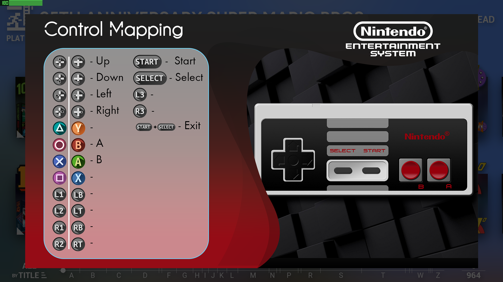
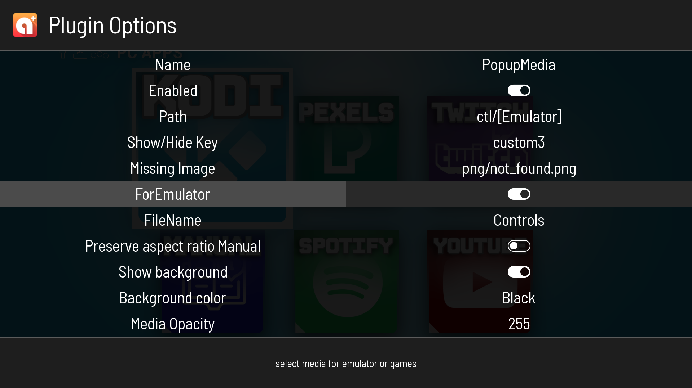
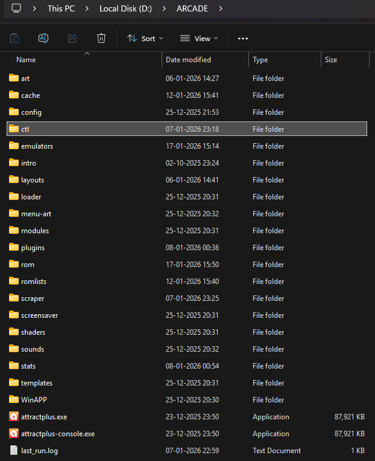
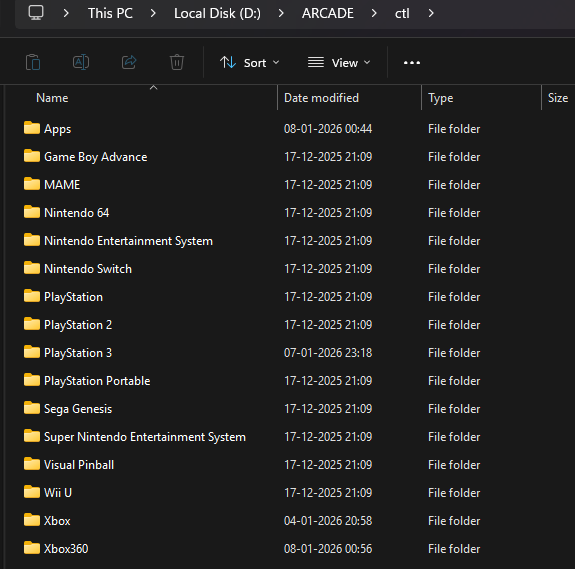
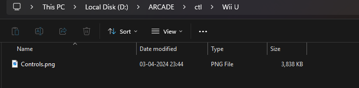

## _MediaPopup Plugin forAttract-Mode frontend_

This Attract mode plugin is based on "joyrider3774/attract_gamemanuals_plugin." It employs a single button (show and hide) and only displays one media.For my own usage, I have altered this to show control mapping for every emulator.
For displaying media, such as instructions, controls, and video, supported files include mp4, avi, bmp, tga, png, jpg, jpeg, swf, and gif.

### Options
#### `New`FileName
* filename for the emulator's media
* Default: `Controls` (without extension)

#### `New`Option For Emulator
* Option `on`-If it is set to on, the plugin will look for the filename instead of the game name to set media at the emulator level(`media/[Emulator]`-> media/emulator1/filename.ext,media/emulator2/filename.ext).
* Option `off`-If it is set to off, the plugin will look for the game name to set media (`media/[Emulator]`-> media/emulator1/gamename1.ext,media/emulator1/gamename2.ext).
* Default: On

#### Path 
* Path to manuals - can include `[Name]`, `[Emulator]`, `[Year]`, `[Manufacturer]`, `[System]`, `[DisplayName]`
* Default: `media/[Emulator]` 
* Note: Path is relative to home(attractmode folder)
#### Show/Hide Key
* Key to use to trigger displaying the media, can be `custom1`, `custom2`, `custom3`, `custom4`, `custom5`, `custom6`
* Default: `custom3`
* Note: You have to assign the buttons / keys in input configuration in attract mode
	

#### Missing Image 
* Path to 'missing' image - can include `[Name]`, `[Emulator]`, `[Year]`, `[Manufacturer]`, `[System]`, `[DisplayName]`
* Default: `png/not_found.png` (png subfolder of the plugin's directory)

#### Preserve aspect ratio Media
* Preserve aspect ratio of the game media, can be `Yes`, `No`
* Default: `Yes`
* Note: Set to no if you want to stretch all your media pages to fullscreen

#### Show background
* Shows a background when Preserve aspect ratio is set overlaying the layout, can be `Yes`, `No`
* Default: `Yes`
* Note: Has no effect when `Preserve aspect ratio Manual` is not enabled 

#### Background color
* Color of the background to display when preserve aspect ratio is set, can be `Black`, `White`, `Grey`, `Blue`, `Red`, `Yellow`, `Green`, `Magenta` 
* Default: `Black`

#### media Opacity
* Apply transparancy to the media (255 is fully visible), can be `25`, `50`, `75`, `100`, `125`, `150`, `175`, `200`, `225`, `255`
* Default: `255` 

#### Background Opacity
* Apply transparancy to background (255 is fully visible), can be `25`, `50`, `75`, `100`, `125`, `150`, `175`, `200`, `225`, `255`
* Default: `175`

## Example
This is set up for control mapping media for each emulator.  

</img>

Plugins Settings

</img>  
  
path: `ctl/[Emulator]`- Path is relative to home(attractmode folder) 

ForEmulaor: `ON` - use filename:`Controls` 

File Structure  

AM Folder   
</img>     

Ctl Folder  

</img>    

[Emulator] Folder

</img>   

## Thanks
This plugin is modified version of <https://github.com/joyrider3774/attract_gamemanuals_plugin>
Thankyou **joyrider3774**
My version is a little simplified and nerfed, but it serves my goal.

